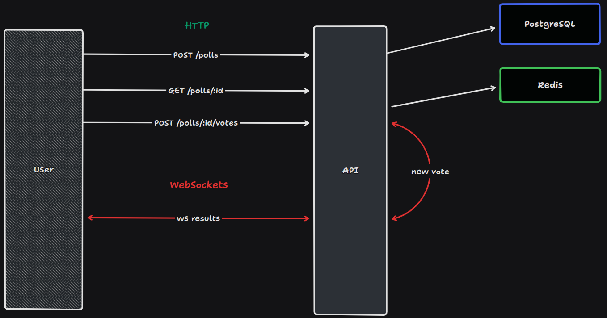

# Voting System (Nodejs)

This application was developed using Nodejs, Docker, PostgreSQL, Prisma, Redis and Typescript.

## Project diagram



## Running

After cloning the repository, access the project folder and execute the commands below:

```sh
npm install
npm run dev
```